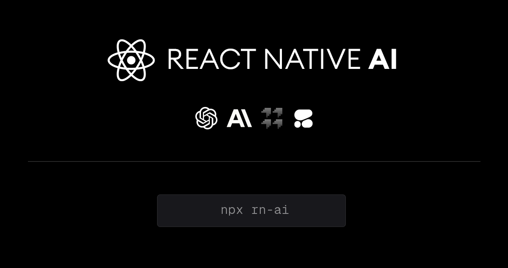

# React Native AI

Full stack mobile framework for building AI apps supporting image processing, real-time / streaming text and chat UIs, and image uploads with multiple service providers.

## Features

- LLM support for [OpenAI](https://openai.com/) ChatGPT, [Anthropic](https://anthropic.com) Claude, [Cohere](https://cohere.com/) and Cohere Web
- Image processing with [ByteScale](https://bytescale.com/)
- Real-time / streaming responses from all providers
- An array of image models provided by [Fal.ai](https://www.fal.ai/)
- OpenAI Assistants including code interpreter and retrieval
- Server proxy to easily enable authentication and authorization with auth provider of choice.
- Theming (comes out of the box with 3 themes) - easily add additional themes with just a few lines of code.

