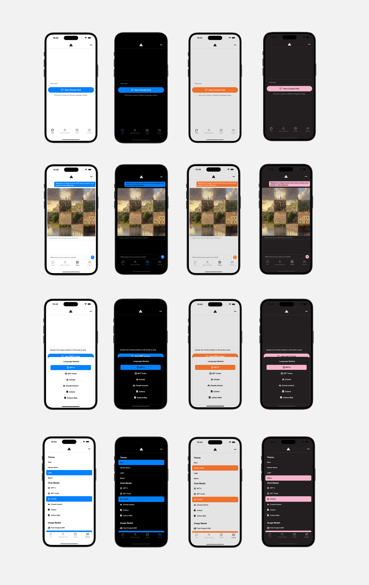

# React Native AI

Full stack mobile framework for building cross-platform mobile AI apps supporting image processing, real-time / streaming text and chat UIs, and image uploads with multiple service providers.


## Features

- LLM support for [OpenAI](https://openai.com/) ChatGPT, [Anthropic](https://anthropic.com) Claude, [Cohere](https://cohere.com/) and Cohere Web
- Image processing with [ByteScale](https://bytescale.com/)
- Real-time / streaming responses from all providers
- An array of image models provided by [Fal.ai](https://www.fal.ai/)
- OpenAI Assistants including code interpreter and retrieval
- Server proxy to easily enable authentication and authorization with auth provider of choice.
- Theming (comes out of the box with 4 themes) - easily add additional themes with just a few lines of code.



## Usage

Generate a new project by running:

```sh
npx rn-ai
```

Next, either configure your environment variables with the CLI, or do so later.

### Running the app

Change into the app directory and run:

```sh
npm start
```

### Running the server

Change into the server directory and run:

```sh
npm run dev
```